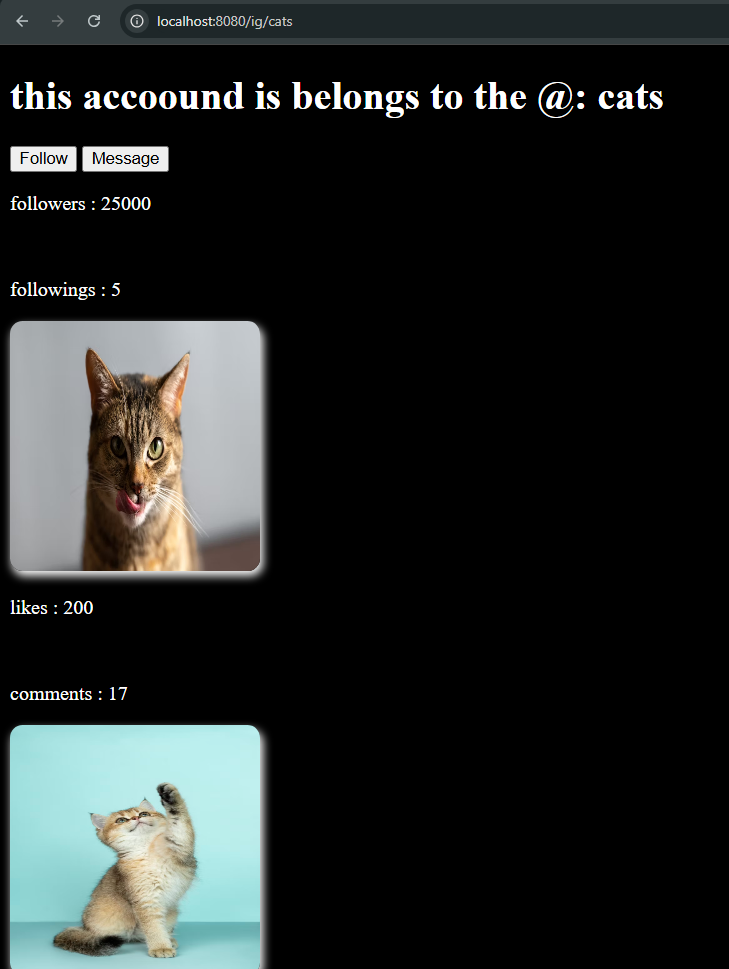

# EJS Templating Practice 🚀

This repository contains basic to intermediate level practice of using **EJS (Embedded JavaScript)** templating with **Express.js**. It demonstrates how to set up views, serve static files, and modularize your HTML using EJS includes.

## 📁 Folder Structure

project/
├── views/
│ ├── index.ejs
│ └── includes/
│ ├── head.ejs
│ └── footer.ejs
├── public/
│ ├── css/
│ └── js/
├── app.js


## 💡 Key Concepts Covered

- Setting up **EJS** with Express
- Using `<% %>`, `<%= %>`, and `<%- %>` tags
- Creating reusable components with `includes`
- Serving static files using the `public` folder
- Using `path.join()` to manage directories safely

## 🛠️ Installation & Running

1. Clone the repo:
   ```bash
   git clone https://github.com/yourusername/ejs-templating-practice.git
   cd ejs-templating-practice
2. Install dependencies:
   npm install
3. Start the server:
   nodemon index.js
4. Open your browser and go to:
 http://localhost:8080

 # 📸 Screenshots


📚 What's Next?
I'll be exploring:

GET and POST requests in Express

Form handling

Creating mini-projects using EJS

✨ Author
Made with ❤️ by Rayaan (Ghouse)
codewithghouse